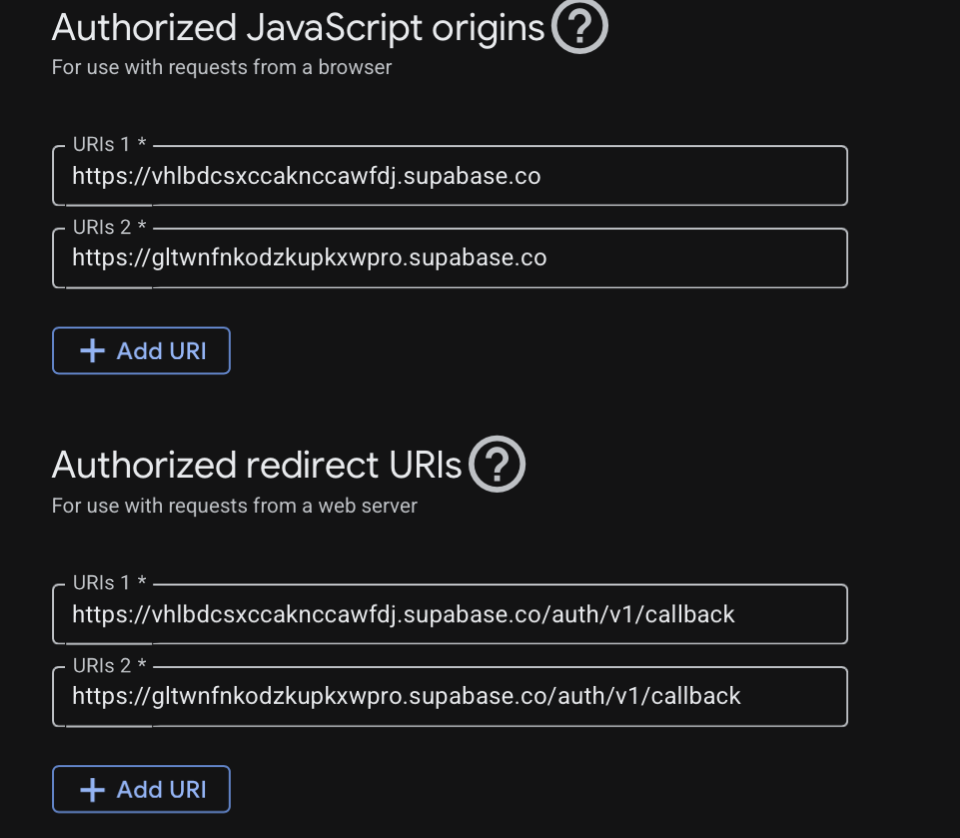

<objective>
Register the prod Vercel URL + the prod Supabase project's `auth/v1/callback` in BOTH Google Cloud Console and Supabase Auth so OAuth completes on the live URL with a fresh Google account. Two distinct dashboards, two distinct callbacks — Google does NOT support wildcards (the prod ref must be listed verbatim); Supabase DOES support `*.vercel.app/auth/callback` as a wildcard (the existing AUTH-08-OPS-CHECKLIST.md is the canonical disambiguation reference; this plan extends it with the prod cutover section).

Purpose: Closes DEP-04. After this plan, a portfolio reviewer can sign in on the production URL with their own Google account.

Output: Updated AUTH-08-OPS-CHECKLIST.md with a "Part 3 — Production Cutover" section + DEP-04 rows in 07-VERIFICATION.md + a recorded successful sign-in test.

Prerequisite: Plan 07-05 must have shipped — this plan needs `<PROD_REF>` (prod Supabase ref) and `<PROD_VERCEL_URL>` from 07-VERIFICATION.md.
</objective>

<execution_context>
@$HOME/.claude/get-shit-done/workflows/execute-plan.md
@$HOME/.claude/get-shit-done/templates/summary.md
</execution_context>

<context>
@.planning/PROJECT.md
@.planning/phases/07-polish-deployment/07-CONTEXT.md
@.planning/phases/07-polish-deployment/07-RESEARCH.md
@.planning/phases/07-polish-deployment/07-VERIFICATION.md
@.planning/phases/02-authentication-landing/AUTH-08-OPS-CHECKLIST.md
@dealdrop/app/auth/callback/route.ts
@dealdrop/supabase/config.toml
</context>

<tasks>

<task type="checkpoint:human-action" gate="blocking">
  <name>Task 1: Register prod Supabase auth/v1/callback in Google Cloud Console</name>
  <files>(no files modified directly — operator-driven; artifacts updated via <how-to-verify> steps)</files>
  <read_first>
    - .planning/phases/02-authentication-landing/AUTH-08-OPS-CHECKLIST.md (Part 1 — the existing dev-ref registration; lines 25-46)
    - .planning/phases/07-polish-deployment/07-RESEARCH.md (Pattern 4 — TWO callback URIs disambiguated, the failure-mode table)
    - .planning/phases/07-polish-deployment/07-VERIFICATION.md (DEP-03 row from Plan 07-05 — `<PROD_REF>`)
  </read_first>
  <action>Operator-driven checkpoint. Follow the numbered steps in <how-to-verify> verbatim. Each step has an explicit expected output / observed value. The acceptance_criteria block at the bottom of this task is the gate; do NOT mark this task done unless every acceptance row is satisfied.</action>
  <what-built>
    Plan 07-05 created Supabase prod project at `<PROD_REF>`. Google's existing OAuth 2.0 Client currently lists only the dev Supabase ref in Authorized redirect URIs. This task adds the prod ref — Google does NOT support wildcards, so each ref must be listed verbatim.
  </what-built>
  <how-to-verify>
    **Step 1 — Open Google Cloud Console:**
    1. https://console.cloud.google.com → select the DealDrop project (the one created at Phase 2 per AUTH-08-OPS-CHECKLIST.md Part 1).
    2. Navigate: APIs & Services → Credentials.
    3. Click the existing OAuth 2.0 Client ID (named "DealDrop Web" or similar).

    **Step 2 — Add the prod Supabase callback to Authorized redirect URIs:**

    Under "Authorized redirect URIs", you should see ONE existing entry:
    ```
    https://vhlbdcsxccaknccawfdj.supabase.co/auth/v1/callback   <-- dev (existing)
    ```

    Click "+ ADD URI" and paste EXACTLY (replacing `<PROD_REF>` with the value from 07-VERIFICATION.md DEP-03):
    ```
    https://<PROD_REF>.supabase.co/auth/v1/callback
    ```

    **Important constraints:**
    - Google does NOT support wildcards (`*`). Each Supabase ref must be listed verbatim.
    - Do NOT remove the dev entry. Local dev still needs it.
    - Final state: TWO entries in Authorized redirect URIs.

    **Step 3 — Add prod Supabase origin to Authorized JavaScript origins:**

    Under "Authorized JavaScript origins", add:
    ```
    https://<PROD_REF>.supabase.co
    ```

    Final state: TWO entries (dev + prod).

    **Step 4 — Save:**
    Click "Save" at the top of the page. Wait ~30 seconds for the Google config to propagate.

    **Step 5 — Capture for 07-VERIFICATION.md:**

    Take a screenshot of the Authorized redirect URIs panel showing both entries. Save to `.planning/phases/07-polish-deployment/screenshots/dep-04-google-redirects.png`.

    Append to 07-VERIFICATION.md:

    ```markdown
    ## DEP-04: Production OAuth Registration (Google Cloud Console)

    **Authorized redirect URIs:**
    | URI | Scope | Status |
    |-----|-------|--------|
    | `https://vhlbdcsxccaknccawfdj.supabase.co/auth/v1/callback` | dev | preserved |
    | `https://<PROD_REF>.supabase.co/auth/v1/callback` | prod | added |

    **Authorized JavaScript origins:**
    | Origin | Status |
    |--------|--------|
    | `https://vhlbdcsxccaknccawfdj.supabase.co` | preserved |
    | `https://<PROD_REF>.supabase.co` | added |

    Screenshot: 
    ```
  </how-to-verify>
  <acceptance_criteria>
    - Google Cloud Console OAuth client shows BOTH dev and prod Supabase ref `auth/v1/callback` URIs (verbatim, no wildcards)
    - JavaScript origins include both Supabase ref origins
    - Save succeeded (no validation errors from Google)
    - Screenshot captured at `screenshots/dep-04-google-redirects.png`
    - 07-VERIFICATION.md DEP-04 Google section appended
  </acceptance_criteria>
  <resume-signal>Type "approved: Google updated" once both URIs are saved and the screenshot is captured. If Google rejects the URI (validation error), type "deviation: Google rejected: &lt;message&gt;".</resume-signal>
  <verify>
    <automated>MISSING — checkpoint task; verification is operator-driven via <how-to-verify> + <acceptance_criteria>; no automated command applies</automated>
  </verify>
  <done>All <acceptance_criteria> rows satisfied; <resume-signal> typed by operator.</done>
</task>

<task type="checkpoint:human-action" gate="blocking">
  <name>Task 2: Configure Supabase prod project — Site URL + Redirect URLs + enable Google provider</name>
  <files>(no files modified directly — operator-driven; artifacts updated via <how-to-verify> steps)</files>
  <read_first>
    - .planning/phases/02-authentication-landing/AUTH-08-OPS-CHECKLIST.md (Part 2 — the dev-project Auth setup; lines 50-66)
    - .planning/phases/07-polish-deployment/07-RESEARCH.md (Pattern 4 — Supabase URL Configuration with wildcards; failure-mode table)
    - .planning/phases/07-polish-deployment/07-VERIFICATION.md (DEP-01 + DEP-03 rows — `<PROD_VERCEL_URL>` + `<PROD_REF>`)
  </read_first>
  <action>Operator-driven checkpoint. Follow the numbered steps in <how-to-verify> verbatim. Each step has an explicit expected output / observed value. The acceptance_criteria block at the bottom of this task is the gate; do NOT mark this task done unless every acceptance row is satisfied.</action>
  <what-built>
    The prod Supabase project from Plan 07-05 has an empty Auth configuration. This task sets the Site URL, the Redirect URLs allow list (with wildcard for Vercel previews), and enables the Google provider using the same Client ID/Secret as the dev OAuth client (single OAuth app serving both projects).
  </what-built>
  <how-to-verify>
    **Step 1 — Open Supabase prod project Authentication:**
    1. https://supabase.com/dashboard/project/`<PROD_REF>`/auth/providers
    2. Find the "Google" row, toggle "Enabled" ON.
    3. Paste:
       - **Client ID:** the same value used in dev (from Google Cloud Console → Credentials → your OAuth client → Client ID).
       - **Client Secret:** the same value used in dev. (If lost, regenerate in Google Cloud Console — note: regenerating invalidates the dev project's secret too. For portfolio bar, capture once and store in a password manager.)
    4. Click Save.

    **Step 2 — Set Site URL + Redirect URLs:**
    1. Navigate: https://supabase.com/dashboard/project/`<PROD_REF>`/auth/url-configuration
    2. **Site URL:** paste `https://<PROD_VERCEL_URL>` (no trailing slash). This is the default `redirectTo` when a Server Action calls `supabase.auth.signInWithOAuth({...})` without an explicit `redirectTo`.
    3. **Redirect URLs (allow list):** add the following entries (one per line in the text area, no trailing commas):
       ```
       https://<PROD_VERCEL_URL>/auth/callback
       https://*.vercel.app/auth/callback
       ```
       Supabase DOES support `*` wildcards (single segment) and `**` (cross-segment). The `*.vercel.app` wildcard covers preview deployments.
    4. Save.

    **Step 3 — Verify the dev project's Auth config is NOT modified:**
    Open https://supabase.com/dashboard/project/vhlbdcsxccaknccawfdj/auth/url-configuration in another tab and confirm the dev Site URL + Redirect URLs are unchanged from Phase 2 setup.

    **Step 4 — Append to 07-VERIFICATION.md:**

    ```markdown
    ## DEP-04: Production OAuth Registration (Supabase Auth — prod project `<PROD_REF>`)

    | Setting | Value | Status |
    |---------|-------|--------|
    | Auth → Providers → Google | Enabled with same Client ID/Secret as dev | enabled |
    | Auth → URL Configuration → Site URL | `https://<PROD_VERCEL_URL>` | set |
    | Auth → URL Configuration → Redirect URLs | `https://<PROD_VERCEL_URL>/auth/callback` AND `https://*.vercel.app/auth/callback` | set |

    Dev project (`vhlbdcsxccaknccawfdj`) Auth config: unchanged (verified).
    ```
  </how-to-verify>
  <acceptance_criteria>
    - Supabase prod project → Auth → Providers → Google: Enabled with Client ID + Secret pasted
    - Supabase prod project → Auth → URL Configuration → Site URL = `https://<PROD_VERCEL_URL>`
    - Supabase prod project → Auth → URL Configuration → Redirect URLs contains BOTH `https://<PROD_VERCEL_URL>/auth/callback` AND `https://*.vercel.app/auth/callback`
    - Dev project Auth config is unchanged
    - 07-VERIFICATION.md DEP-04 Supabase section appended
  </acceptance_criteria>
  <resume-signal>Type "approved: Supabase prod auth configured" once Site URL + Redirect URLs + Google provider are all saved. If Client Secret was regenerated, also type "secret rotated" to flag the dev project may need a re-paste.</resume-signal>
  <verify>
    <automated>MISSING — checkpoint task; verification is operator-driven via <how-to-verify> + <acceptance_criteria>; no automated command applies</automated>
  </verify>
  <done>All <acceptance_criteria> rows satisfied; <resume-signal> typed by operator.</done>
</task>

<task type="checkpoint:human-verify" gate="blocking">
  <name>Task 3: End-to-end prod OAuth smoke test with a fresh Google account</name>
  <files>(no files modified directly — operator-driven; artifacts updated via <how-to-verify> steps)</files>
  <read_first>
    - .planning/phases/07-polish-deployment/07-VERIFICATION.md (DEP-01 — `<PROD_VERCEL_URL>`; DEP-04 — both Google + Supabase configs)
    - .planning/phases/07-polish-deployment/07-RESEARCH.md (Pattern 4 §"Common failure modes" — the symptom table)
    - dealdrop/app/auth/callback/route.ts (the app's callback handler; verify Phase 2's flow is unchanged)
  </read_first>
  <action>Operator-driven checkpoint. Follow the numbered steps in <how-to-verify> verbatim. Each step has an explicit expected output / observed value. The acceptance_criteria block at the bottom of this task is the gate; do NOT mark this task done unless every acceptance row is satisfied.</action>
  <what-built>
    Both registrations are now in place. This task is the proof: a fresh Google account that has never signed in to DealDrop completes OAuth on the prod URL.
  </what-built>
  <how-to-verify>
    **Step 1 — Open the prod URL in an INCOGNITO window** (no cookies, no prior sessions): `https://<PROD_VERCEL_URL>/`

    **Step 2 — Walk the OAuth flow:**
    1. Hero page loads (logged-out state — confirms 200 and Tailwind classes work in prod, addresses R-07).
    2. Click "Sign In" in the header → AuthModal opens.
    3. Click "Continue with Google".
    4. Google consent screen opens. Use a Google account that has NEVER signed in to DealDrop (NOT your dev account, NOT the Resend account owner — pick a fresh address; this Google account will be reused for the DEP-06 non-owner email test in Plan 07-08).
    5. Complete the Google consent.
    6. Browser redirects: Google → Supabase prod `/auth/v1/callback` → DealDrop `/auth/callback` → `/`.
    7. Logged-in dashboard renders (DashboardShell + EmptyState — no products yet for this fresh user).

    **Step 3 — Verify the session is real:**
    1. Check the URL shows `/` (no `?auth_error=1` or hash fragments).
    2. Header shows "Sign Out" instead of "Sign In".
    3. Open Supabase prod SQL Editor:
       ```sql
       SELECT id, email, last_sign_in_at FROM auth.users ORDER BY last_sign_in_at DESC LIMIT 1;
       ```
       Expected: 1 row matching the fresh Google account email; `last_sign_in_at` is within the last few seconds.

    **Step 4 — If the flow breaks**, consult RESEARCH.md Pattern 4's failure-mode table:
    - `redirect_uri_mismatch` from Google → prod ref not in Google Authorized redirect URIs (Task 1)
    - Lands on `/?auth_error=1` → prod URL not in Supabase Redirect URLs (Task 2)
    - Redirects to localhost → Site URL not set in Supabase (Task 2)

    Surface a deviation with the exact symptom and STOP.

    **Step 5 — Append to 07-VERIFICATION.md:**

    ```markdown
    ## DEP-04: Production OAuth Smoke Test

    | Step | Action | Observed | Expected | Status |
    |------|--------|----------|----------|--------|
    | 1 | Open prod URL in incognito | Hero loads, 200 | Hero | PASS |
    | 2 | Click Sign In → Continue with Google with FRESH Google account | Google consent shown | Consent | PASS |
    | 3 | Complete consent | Redirects through Supabase callback to `/` | `/` with session | PASS |
    | 4 | Header shows Sign Out | Yes | Yes | PASS |
    | 5 | `SELECT id,email,last_sign_in_at FROM auth.users ORDER BY last_sign_in_at DESC LIMIT 1` in prod SQL | 1 row, fresh email, recent timestamp | 1 row | PASS |

    **Date:** <YYYY-MM-DD>
    **Operator:** <user>
    **Fresh account email used:** <hide / placeholder> (saved for DEP-06 non-owner test)
    ```

    **Step 6 — Append a "Part 3 — Production Cutover" section to AUTH-08-OPS-CHECKLIST.md:**

    Add at the bottom of `.planning/phases/02-authentication-landing/AUTH-08-OPS-CHECKLIST.md`:

    ```markdown
    ---

    ## Part 3 — Production Cutover (added by Phase 7 Plan 07-06)

    **Prod Supabase project ref:** `<PROD_REF>` (added 2026-04-25)
    **Prod Vercel URL:** `https://<PROD_VERCEL_URL>` (assigned by Plan 07-05)

    **Google Cloud Console — Authorized redirect URIs (now contains both):**
    ```
    https://vhlbdcsxccaknccawfdj.supabase.co/auth/v1/callback   <-- dev
    https://<PROD_REF>.supabase.co/auth/v1/callback             <-- prod (added)
    ```

    **Supabase prod project — Auth → URL Configuration:**
    - Site URL: `https://<PROD_VERCEL_URL>`
    - Redirect URLs:
      - `https://<PROD_VERCEL_URL>/auth/callback`
      - `https://*.vercel.app/auth/callback`

    **Supabase prod project — Auth → Providers → Google:** Enabled with same Client ID/Secret as dev OAuth client (single Google OAuth client serves both projects).

    **Smoke test:** Fresh Google account completed OAuth on prod URL on `<YYYY-MM-DD>`. See `.planning/phases/07-polish-deployment/07-VERIFICATION.md` DEP-04 row.
    ```
  </how-to-verify>
  <acceptance_criteria>
    - Fresh Google account completes OAuth on prod URL without errors
    - Session is real: Header shows Sign Out + auth.users has new row
    - 07-VERIFICATION.md DEP-04 smoke-test table appended (5 PASS rows)
    - AUTH-08-OPS-CHECKLIST.md Part 3 appended with prod URLs + smoke-test reference
    - The fresh Google account email is recorded (for the DEP-06 non-owner email test in Plan 07-08)
  </acceptance_criteria>
  <resume-signal>Type "approved: prod OAuth smoke green" with the fresh Google account placeholder reference. If broken, type "deviation: &lt;Google rejection / Supabase callback / localhost redirect / other&gt;".</resume-signal>
  <verify>
    <automated>MISSING — checkpoint task; verification is operator-driven via <how-to-verify> + <acceptance_criteria>; no automated command applies</automated>
  </verify>
  <done>All <acceptance_criteria> rows satisfied; <resume-signal> typed by operator.</done>
</task>

</tasks>

<threat_model>
## Trust Boundaries

| Boundary | Description |
|----------|-------------|
| Browser → Google sign-in | TLS to accounts.google.com; Google validates the OAuth client + redirect URI against the configured allow list |
| Google → Supabase prod /auth/v1/callback | TLS; Supabase validates the OAuth code + state against its session store |
| Supabase prod → DealDrop /auth/callback | TLS to prod Vercel URL; DealDrop's Route Handler exchanges the code for a session cookie (HttpOnly + SameSite via @supabase/ssr) |

## STRIDE Threat Register

| Threat ID | Category | Component | Disposition | Mitigation Plan |
|-----------|----------|-----------|-------------|-----------------|
| T-07-13 | Tampering | Open redirect via /auth/callback | mitigate | Phase 2's Route Handler at `dealdrop/app/auth/callback/route.ts` redirects only to `origin` derived from `request.url` (Phase 2 02-REVIEW.md). Plan 07-06 doesn't modify this; only registers the prod URL in the allow lists. |
| T-07-14 | Spoofing | Wrong OAuth client serves prod | accept | Single OAuth client serves both dev and prod Supabase projects (CONTEXT.md Discretion). At portfolio bar this is acceptable; production-hardening would use separate clients with separate quotas. |
| T-07-15 | Information Disclosure | OAuth Client Secret leaked during paste | mitigate | Operator pastes once into Supabase prod; Client Secret stored in Supabase Auth (not visible in env / code). Documented in Task 2 — store in password manager, do NOT commit. |
| T-07-16 | DoS | Wildcard `*.vercel.app/auth/callback` allows preview-deploy phishing | accept | Supabase wildcard support is intentional (preview-deploy convenience). Risk surface is "any vercel.app site can complete OAuth" — bounded by attacker controlling a vercel.app subdomain AND tricking a user there. Acceptable at portfolio bar. |
</threat_model>

<verification>
- Google Cloud Console OAuth client → Authorized redirect URIs contains `https://<PROD_REF>.supabase.co/auth/v1/callback` (verified by screenshot in `screenshots/dep-04-google-redirects.png`)
- Supabase prod → Auth → URL Configuration → Site URL = `https://<PROD_VERCEL_URL>` (verified in 07-VERIFICATION.md DEP-04 Supabase section)
- Supabase prod → Auth → URL Configuration → Redirect URLs contains both prod and wildcard
- Fresh-account OAuth smoke test: 5 PASS rows in 07-VERIFICATION.md DEP-04 smoke-test section
- `SELECT email FROM auth.users ORDER BY last_sign_in_at DESC LIMIT 1` in prod SQL returns the fresh Google account email
- AUTH-08-OPS-CHECKLIST.md Part 3 appended
</verification>

<success_criteria>
- DEP-04 closed: prod OAuth registration in BOTH Google + Supabase
- Fresh-account smoke test passes on prod URL
- AUTH-08-OPS-CHECKLIST.md extended with Part 3 (production cutover)
- Dev project's Auth config unchanged
- Fresh Google account email recorded for DEP-06 non-owner email test (Plan 07-08)
</success_criteria>

<output>
After completion, create `.planning/phases/07-polish-deployment/07-06-SUMMARY.md` capturing:
- Google Cloud Console redirect URIs final list (dev + prod)
- Supabase prod Site URL + Redirect URLs
- OAuth smoke-test outcome (5 PASS rows)
- The fresh Google account placeholder reference (for Plan 07-08)
- Confirmation dev project Auth is unchanged
- Path to the screenshot at `screenshots/dep-04-google-redirects.png`
</output>
