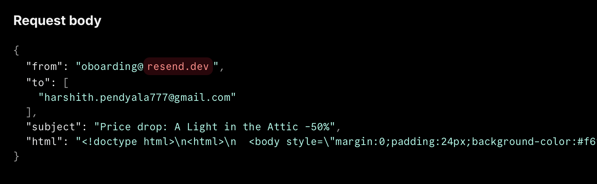
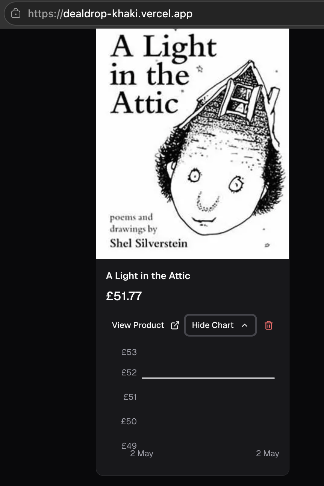

# DealDrop

> Universal e-commerce price tracker. Paste any product URL, get an email the moment the price drops. Live at **[dealdrop-khaki.vercel.app](https://dealdrop-khaki.vercel.app)**.

[](https://dealdrop-khaki.vercel.app)
[](https://github.com/harshith-pendyala/dealdrop/releases)
[]()
[]()

DealDrop is a portfolio project that ships the full loop most people only describe in tutorials: a user pastes any product URL, the app scrapes structured data, persists it under row-level security, runs a daily Postgres cron job to re-check prices, and sends a transactional email the moment a price drops — with a per-user dashboard and price-history charts. Two milestones, ten phases, 177 passing tests, deployed to Vercel.

---

## What you can do with it

1. Sign in with Google.
2. Paste any e-commerce product URL — Amazon, a niche shop, anything Firecrawl can render.
3. The app scrapes name, price, currency, and image, persists it under your user, and confirms with a toast.
4. Each tracked product appears as a card on your dashboard with a toggleable Recharts price-history chart.
5. A `pg_cron` job runs daily at 09:00 UTC, re-scrapes every product across every user, and writes a new `price_history` row whenever the price changes.
6. When the new price is lower than the last recorded price, you get a Resend-delivered HTML email with the percentage drop, the old vs new price, and a click-through to the product.

## Screenshots

| Daily price-drop email | Per-product price history |
|-----|-----|
|  |  |

---

## Tech stack — and why each choice

| Layer | Tool | Reason |
|-------|------|--------|
| Framework | **Next.js 16** (App Router, React 19, TypeScript strict) | Server actions for the price-check pipeline, RSC for the dashboard, single deploy target |
| Backend | **Supabase** (Postgres + Auth + Vault + `pg_cron` + `pg_net`) | One platform for DB, auth, RLS, and the daily cron — no second hosting bill |
| Scraping | **Firecrawl v2** | Structured-JSON output without writing a per-site scraper; one API for every shop |
| Email | **Resend** | Generous free tier, clean Next.js SDK, pure HTTP API |
| Charts | **Recharts** | React-native, no canvas refs, plays well with RSC boundaries |
| UI | **Tailwind CSS v4** + **Shadcn UI** + **Lucide** | Drop-in primitives, OKLCH design tokens, dark mode via OS preference |
| Toasts | **Sonner** | Shadcn-compatible, accessible, no setup ceremony |
| Hosting | **Vercel** | Native Next.js, fluid compute, GitHub-triggered auto-deploys |
| Tests | **Vitest** (jsdom + node) | Single runner for client components and server logic |

---

## Architecture highlights

- **Strict server-only env split.** Two env modules (`env.ts` browser-safe, `env.server.ts` server-only via the `import 'server-only'` guard) ensure server-side env-var *names* never reach the client bundle. Validated at boot with Zod via `@t3-oss/env-nextjs` — missing or malformed required values fail fast before the first request. ([`env.server.ts`](dealdrop/src/lib/env.server.ts))
- **Three Supabase factories with explicit blast radius.** A browser client (anon key, RLS-enforced), a server client (RLS-enforced under the user's session), and an admin client (service-role key, bypasses RLS — guarded by `import 'server-only'`). The daily cron uses the admin client *only* to read product owners; user-scoped queries always go through the RLS-respecting clients. ([`src/lib/supabase/`](dealdrop/src/lib/supabase/))
- **Row-level security on every user-owned table.** Cross-user isolation verified via Supabase Management API SQL impersonation — each user sees exactly their own products and price history, never anyone else's. ([Phase 1 verification](.planning/milestones/v1.0-phases/01-foundation-database/))
- **Idempotent daily price-check loop.** `pg_cron` calls a Bearer-protected `POST /api/cron/check-prices` endpoint that iterates all products, re-scrapes via Firecrawl, writes new `price_history` rows only when the price actually changes, and triggers the email pipeline via `Promise.allSettled` — one product's failure doesn't kill the rest. ([`/api/cron/check-prices`](dealdrop/app/api/cron/check-prices/))
- **Env-configurable email pipeline (v1.1).** `to: env.RESEND_TEST_RECIPIENT ?? input.to` — single nullish-coalesce expression at the SDK call site flips between test-recipient mode (every alert lands in one inbox) and production mode (alert goes to the real user). The v1.2 cutover after domain verification will be a one-env-var redeploy, no code change. ([`resend.ts:160`](dealdrop/src/lib/resend.ts#L160))
- **Two-tier error boundary** with Next.js 16's `unstable_retry` — page-level boundary catches feature failures, root boundary catches layout-level catastrophes. Neither leaks `error.message` to the DOM. ([`app/error.tsx`](dealdrop/app/error.tsx) + [`app/global-error.tsx`](dealdrop/app/global-error.tsx))
- **Type-safe DB layer.** TypeScript types generated from the live Supabase schema via the Management API, so `Database['public']['Tables']['products']['Row']` is what the DB actually returns — not a hand-maintained type drifting from reality.

---

## Features

- Universal product tracking — paste any URL from any e-commerce site
- Google OAuth sign-in (no password UX)
- Per-user private dashboard, RLS-enforced
- Recharts price-history line chart per product, toggleable on the card
- Daily automated price check (`pg_cron`, 09:00 UTC)
- HTML email alert on any price drop (Resend)
- Track-failure surfacing on the product card when scrape fails
- Optimistic UI on add/remove with toast confirmations (Sonner)
- Branded UI: orange `--primary` cascade, header logo, custom favicon
- Dark mode (OS preference) without a layout shift

---

## Project rigor — what makes this more than a tutorial clone

This isn't `clone the repo, run dev, ship to Vercel`. The project is structured around the [GSD (Get Shit Done)](https://github.com/anthropics/get-shit-done) workflow: every shipped feature traces back to a numbered requirement, every phase has a written plan, every plan has a written summary, and every shipped milestone has a retrospective.

| Artifact | What it shows |
|----------|---------------|
| [`.planning/PROJECT.md`](.planning/PROJECT.md) | Product north star, validated requirements, key decisions with outcomes |
| [`.planning/ROADMAP.md`](.planning/ROADMAP.md) | All 9 phases, milestone groupings, completion dates |
| [`.planning/MILESTONES.md`](.planning/MILESTONES.md) | Per-milestone summary with stats, accomplishments, deferred items |
| [`.planning/RETROSPECTIVE.md`](.planning/RETROSPECTIVE.md) | Honest write-up: what worked, what was inefficient, lessons for next milestone |
| [`.planning/milestones/`](.planning/milestones/) | Archived per-milestone roadmaps + requirements + audits |
| [`.planning/phases/*/`](.planning/phases/) | Per-phase context, plans, summaries, verifications, code reviews |

The retrospective is genuinely candid — it calls out a nested-`.git` workflow trap, a CLI bug in the audit tool, and patterns that worked vs patterns that wasted time. Recruiters who read it will get an honest signal about how I work.

**Test discipline:** 177 passing Vitest tests (jsdom for components, node for server logic) across 21 files. Every phase plan has an explicit Nyquist verification check before merge. Code review pass on v1.1 found zero critical / zero warning findings.

---

## Run locally

```bash
git clone https://github.com/harshith-pendyala/dealdrop.git
cd dealdrop/dealdrop          # the Next.js app lives in the subdir
npm install
cp .env.example .env.local    # then fill in keys (Supabase, Firecrawl, Resend, CRON_SECRET)
npm run dev                   # http://localhost:3000
```

Full env-var documentation: [`dealdrop/README.md`](dealdrop/README.md).

Test suite:
```bash
npm test                                  # all 177 tests
npx vitest run src/lib/resend.test.ts    # one module
```

---

## Roadmap

- ✅ **v1.0 MVP** (May 2 2026) — Foundation, auth, scraping, dashboard, charts, daily cron + email, deployed to prod
- ✅ **v1.1 Brand Polish & Email Config** (May 3 2026) — Branded UI (orange `--primary`, logo, favicon, "Track Price" CTA), env-configurable Resend pipeline so v1.2 cutover is a one-env-var redeploy
- 📋 **v1.2 Custom Domain & Real Email** (planned) — Custom domain, Resend domain verification (SPF/DKIM/DMARC), Vercel custom domain, production email cutover

---

## About this project

I built DealDrop to demonstrate end-to-end product engineering — not just framework knowledge. It ships the boring-but-load-bearing pieces most portfolio projects skip: env validation that fails fast, RLS that's actually verified under impersonation, a cron job that runs daily on real infrastructure, transactional email that lands in real inboxes, atomic git history with milestone tags, and a planning trail anyone can read to understand why each decision was made.

If you're hiring, the artifacts I'd point you to first are:
1. **[The retrospective](.planning/RETROSPECTIVE.md)** — how I think about what worked and what didn't
2. **[The Phase 9 spec](.planning/phases/09-resend-env-config/)** — how I scope a small refactor (research → discuss → plan → execute → verify) for a 1-line code change that unblocks a future milestone
3. **[The architecture highlights above](#architecture-highlights)** — the engineering decisions I'd defend in an interview
4. **[The live app](https://dealdrop-khaki.vercel.app)** — see if the loop actually works

Reach me at harshith.pendyala777@gmail.com.

---

*Built with Claude Code + the [GSD workflow](https://github.com/anthropics/get-shit-done). Every commit is atomic, every milestone is tagged, every retrospective is honest.*
